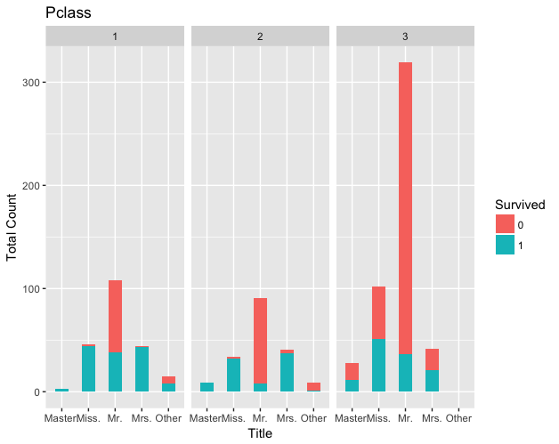

Based on this chart that Scott Farris shared with the group, we determined that the most lucrative targets for building models would be clusters that had some parity between survivors and non-survivors:

<center></center>

We can see that there are a few clusters where the likelihood to survive is very clear.  Those survivors groups include the following:

* Master in 1st or 2nd Class
* Miss in 1st or 2nd Class
* Mrs in 1st or 2nd Class

On the contrary, if you are a Mr in 2nd or 3rd class, your chance of survival is minimal.  However, in the following groups, there is a more reasonable chance to survive.  And these groups provide us with a few opportunities where we may be able to discriminate passengers that are likely to survive or perish:

* Mr in 1st Class
* Miss in 3rd Class
* Mrs in 3rd Class

# Loading the Test and Training Data Sets

So, we start by readin in the test data set, which needs a "survived" column to ensure the same number of columns as our training data.  We set the "survived" value to NA since we don't have that data for this portion of the data.  We load this in just to provide us with a larger set of data to perform exploratory data analysis.

```{r}
test <- read.csv("C:/Projects/Titanic/test.csv", header=TRUE)
test$survived <- NA
View(test)
```

Then, we load in the training set, but this time we move the "survived" column to the end so that the order of columns matches between the training and test sets.

```{r}
train <- read.csv("C:/Projects/Titanic/train.csv", header=TRUE)
train$survived <- train$Survived
train$Survived <- NULL
View(train)
```

Finally, we merge the two data sets so that we can move forward with our analysis on the full data set.

```{r}
full <- rbind(test, train)
full$Title <- gsub('(.*, )|(\\..*)', '', full$Name)
View(full)
```


# We now need to craft some features from the full dataset

Based on conversations in the meetup, we identified the following potential features that we need to extract for the full dataset:

* Size of group traveling together
* Group composition
    + adults
    + kids
    + males
    + females
    + number of cabins in group
    + distance between cabins in group
    + distance in age within group
* Ticket price per person (**Rakesh has started working on this**)
* Length of stay on ship (based on port of embarkment)

## Adding Price/Ticket

```{r}
require(dplyr)
trainfare <- select(train,Ticket,Fare)
x <- trainfare %>% group_by(Ticket) %>% count(Ticket)
y <- left_join(trainfare,x,by = 'Ticket')
Final_price <- mutate(y,Final_Price = Fare/n)
rename(Final_price, c(n="PassengerGroupSize"))# ERROR HERE NEEDS TO BE FIXED!! ###
head(Final_price)
Final_price <- select(Final_price,Ticket,Fare,Final_Price)
```

# Creating our Subsets to Build Targeted Models

Again, based on the histogram that Scott provided us, we are targeting the following subpopulations where there is the chance that we can more reasonably discern factors that distinguish those that survived versus those that perished.

## 1st Class, Adult Males (Mr)

We'll pull out our target clusters from the training set, which is denoted by an NA as the "survived" field value.

```{r}
# 1st class, adult males from the training set (survived is not NA)
class1_adult_males <- full[full$Pclass==1 & full$Title =="Mr" & !is.na(full$survived), ]
View(class1_adult_males)
```

## 3rd Class, Unmarried Females (Miss)

```{r}
# 3rd class, unmarried females from the training set (survived is not NA)
class3_unmarried_females <- full[full$Pclass==3 & full$Title =="Miss" & !is.na(full$survived), ]
View(class3_unmarried_females)
```

## 3rd Class, Married Females (Mrs)

```{r}
# 3rd class, married females from the training set (survived is not NA)
class3_married_females <- full[full$Pclass==3 & full$Title =="Mrs" & !is.na(full$survived), ]
View(class3_married_females)
```


